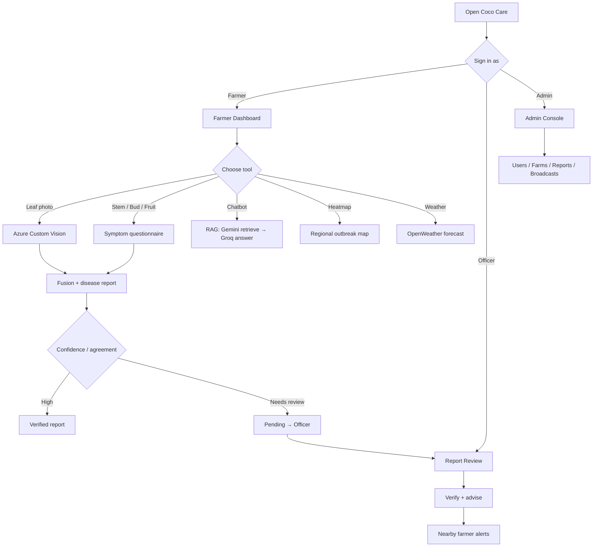
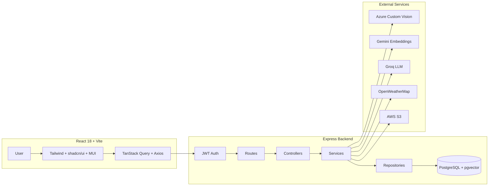

<div align="center">

# Coco Care

### Smart Coconut Farming.

**Detect disease early. Get CRI-grounded advice. Protect every tree.**

[](https://d2qjqi3wenjlo5.cloudfront.net)
[](https://react.dev/)
[](https://vitejs.dev/)
[](https://www.typescriptlang.org/)
[](https://expressjs.com/)
[](https://www.postgresql.org/)
[](https://groq.com/)
[](https://azure.microsoft.com/en-us/products/ai-services/ai-custom-vision)

**[Try it live →](https://d2qjqi3wenjlo5.cloudfront.net)**

</div>

---

## Links

| | |
|---|---|
| Live app | <https://d2qjqi3wenjlo5.cloudfront.net> |
| Repository | <https://github.com/itspsb2/Coco-care> |

---

## Table of Contents

- [Overview](#overview)
- [Key Features](#key-features)
- [Live Demo Flows](#live-demo-flows)
- [Architecture](#architecture)
- [Tech Stack](#tech-stack)
- [Quick Start](#quick-start)
- [Environment Variables](#environment-variables)
- [Project Structure](#project-structure)
- [Available Scripts](#available-scripts)
- [Demo Accounts](#demo-accounts)
- [RAG Knowledge Base](#rag-knowledge-base)
- [Roadmap](#roadmap)
- [Contributing](#contributing)
- [License](#license)

---

## Overview

**Coco Care** is an AI-powered platform that helps coconut farmers detect diseases early, get expert-grounded advice, and connect with agricultural officers.

It combines computer-vision leaf diagnosis, symptom questionnaires for stem / bud / fruit issues, a Retrieval-Augmented-Generation (RAG) chatbot trained on real Coconut Research Institute (CRI) manuals, live weather, and a regional disease heatmap — all wrapped in role-based dashboards for **farmers, officers, and admins**.

The product blends three experiences:

1. **Farmer workspace** — diagnose plants, chat with the CRI-grounded assistant, track reports, and watch local weather + outbreak maps.
2. **Officer review** — verify farmer submissions, add advice, and trigger nearby disease alerts.
3. **Admin console** — manage users, farms, reports, broadcasts, and system health.

---

## Key Features

- **AI disease diagnosis** — Upload a leaf photo for Azure Custom Vision classification, or describe symptoms via guided questionnaires (stem, bud, fruit, general).
- **Fusion engine** — Combines image + symptom confidence; high-agreement results can auto-verify, otherwise reports go to officers for review.
- **Grounded AI chatbot** — Gemini embeddings + pgvector retrieval + Groq generation, answering only from CRI advisory circulars with source citations.
- **Disease heatmap** — Interactive Leaflet map of verified / suspected outbreaks across regions.
- **Weather forecast** — Location-based OpenWeatherMap forecasts for farm planning.
- **Report & review workflow** — Farmers submit diagnoses; officers verify and advise; nearby farmers get radius-based alerts.
- **Role-based access** — Separate apps for Farmer (`/app`), Officer (`/officer`), and Admin (`/admin`).
- **Admin console** — Users, farms, reports, notification broadcasts, and health checks.
- **Image storage** — AWS S3 when configured; data-URL fallback for local demos.

---

## Live Demo Flows



---

## Architecture

Coco Care is a modular monolith: a Vite React SPA talks to an Express REST API over JWT. Long-running AI work (vision, embeddings, LLM) lives in backend services. PostgreSQL + pgvector stores users, farms, reports, chat history, and the CRI knowledge base.



**Request path:** `routes → controller → service → repository`

---

## Tech Stack

| Layer | Technology |
|-------|------------|
| Frontend | React 18, Vite 6, TypeScript, React Router 7 |
| Styling | Tailwind CSS v4, shadcn/ui, Radix, MUI |
| Data / maps | TanStack Query, Axios, Leaflet, Recharts, Motion |
| Backend | Node.js 20+, Express 4, TypeScript |
| Database | PostgreSQL 16 + pgvector (Docker Compose) |
| Auth | JWT + bcrypt, Zod validation |
| Vision | Azure Custom Vision (leaf disease ML) |
| RAG | Gemini embeddings → pgvector → Groq (`llama-3.3-70b-versatile`) |
| Weather | OpenWeatherMap |
| Storage | AWS S3 (optional) |
| Deployment | CloudFront frontend · API + Postgres for backend |

---

## Quick Start

### Prerequisites

- Node.js ≥ 20
- npm ≥ 10
- [Docker Desktop](https://www.docker.com/products/docker-desktop/) (PostgreSQL + pgvector)
- API keys for Gemini, Groq, Azure Custom Vision, and OpenWeatherMap *(see env table)*
- *(optional)* AWS S3 credentials for image uploads

### 1. Backend

```bash
git clone https://github.com/itspsb2/Coco-care.git
cd Coco-care/backend

npm install
cp .env.example .env          # add your API keys

npm run db:up                 # start PostgreSQL + pgvector on :5433
npm run db:migrate            # apply schema
npm run db:seed               # users, farm, CRI knowledge, demo reports
npm run dev                   # http://localhost:3000
```

### 2. Frontend

```bash
cd Coco-care/front_end

npm install
cp .env.example .env          # set VITE_API_BASE_URL=http://localhost:3000

npm run dev                   # http://127.0.0.1:5173
```

- Frontend: <http://127.0.0.1:5173>
- API: <http://localhost:3000>
- Live demo: <https://d2qjqi3wenjlo5.cloudfront.net>

---

## Environment Variables

### Backend (`backend/.env`)

| Variable | Purpose |
|----------|---------|
| `PORT` | HTTP port (default `3000`) |
| `DATABASE_URL` | Postgres connection string (`…@localhost:5433/cococare`) |
| `JWT_SECRET` / `JWT_EXPIRES_IN` | Auth token signing |
| `FRONTEND_ORIGINS` | CORS allowlist for the Vite app |
| `FUSION_CONFIDENCE_THRESHOLD` | Auto-verify threshold (default `0.75`) |
| `AZURE_CV_ENDPOINT` / `AZURE_CV_KEY` / `AZURE_CV_PREDICTION_URL` | Leaf disease vision model |
| `GEMINI_API_KEY` | Required for RAG embeddings + ingest |
| `GEMINI_EMBEDDING_MODEL` / `GEMINI_EMBEDDING_DIMENSIONS` | Embedding model config |
| `RAG_TOP_K` / `RAG_MIN_SCORE` | Retrieval tuning |
| `KNOWLEDGE_DATA_DIR` | Path to CRI manuals (`./data/cri-manuals`) |
| `GROQ_API_KEY` / `GROQ_MODEL` | Grounded answer generation |
| `OPENWEATHER_API_KEY` | Farmer dashboard forecasts |
| `AWS_REGION` / `AWS_S3_BUCKET` | Optional image storage |
| `DISEASE_ALERT_RADIUS_KM` | Nearby alert radius when officers verify |

### Frontend (`front_end/.env`)

| Variable | Purpose |
|----------|---------|
| `VITE_API_BASE_URL` | Backend base URL (`http://localhost:3000`) |
| `VITE_GOOGLE_MAPS_KEY` | Optional Maps key |

See [`backend/.env.example`](backend/.env.example) and [`front_end/.env.example`](front_end/.env.example) for the canonical lists.

---

## Project Structure

```
Coco-care/
├── backend/                     # Express API + PostgreSQL + RAG
│   ├── src/
│   │   ├── modules/             # auth, diagnosis, chat, reports, weather,
│   │   │                        # diseaseMap, farmer, admin, knowledge, notifications
│   │   ├── services/            # Azure Vision, Gemini, Groq, RAG ingest,
│   │   │                        # fusion, weather, S3, questionnaires
│   │   ├── repositories/        # data access
│   │   ├── middleware/          # auth, roles, validate, errors
│   │   ├── db/                  # pool, migrate, seed
│   │   └── config/              # env
│   ├── sql/                     # numbered migrations
│   ├── data/cri-manuals/cri/    # CRI topic markdown for RAG
│   ├── scripts/                 # rag:prepare / ingest / clear helpers
│   ├── tests/                   # Jest + Supertest
│   └── docker-compose.yml       # pgvector/pg16 on port 5433
│
└── front_end/                   # React + Vite SPA
    ├── src/
    │   ├── app/
    │   │   ├── pages/           # farmer, officer, admin screens
    │   │   ├── components/      # shared UI + dashboard chrome
    │   │   ├── layouts/         # officer / admin shells
    │   │   └── routes.tsx       # role-gated React Router tree
    │   ├── api/                 # Axios clients
    │   ├── contexts/            # AuthProvider
    │   ├── routes/              # ProtectedRoute
    │   └── styles/
    └── public/
```

---

## Available Scripts

### Backend (`cd backend`)

| Command | What it does |
|---------|--------------|
| `npm run dev` | Start API with hot reload (`tsx watch`) |
| `npm run build` / `npm start` | Compile TypeScript and run production server |
| `npm run db:up` | Start PostgreSQL + pgvector container |
| `npm run db:down` | Stop the database container |
| `npm run db:reset` | Destroy volume, restart, migrate, seed |
| `npm run db:migrate` | Apply pending SQL migrations |
| `npm run db:seed` | Seed users, farm, CRI knowledge, demo reports |
| `npm run rag:prepare` | Split source manuals into topic files |
| `npm run rag:ingest` | Embed + store CRI chunks in pgvector |
| `npm run rag:clear` | Truncate knowledge tables |
| `npm run test` | Jest + Supertest (needs a running DB) |

### Frontend (`cd front_end`)

| Command | What it does |
|---------|--------------|
| `npm run dev` | Vite dev server on `127.0.0.1:5173` |
| `npm run build` | Production build to `dist/` |

---

## Demo Accounts

All seeded demo users share the password: `password`

| Username | Role |
|----------|------|
| `akeel` | Farmer |
| `officer1` | Officer |
| `admin` | Admin |

---

## RAG Knowledge Base

Answers are grounded in Coconut Research Institute advisory circulars (fertilizer packages, pests, and diseases), split into topic files under `backend/data/cri-manuals/cri/`, including:

- Nutrient requirements & fertilizer recommendations
- Organic fertilizers & basal mixtures
- Bud rot, Weligama leaf wilt
- Black beetle, red weevil, coconut caterpillar, leaf miner

**Refresh the knowledge base:**

```bash
cd backend
npm run rag:prepare          # if regenerating from source manuals
npm run rag:clear && npm run rag:ingest
```

On a fresh `db:seed`, knowledge is ingested automatically when tables are empty.

---

## Roadmap

- Mobile-first Progressive Web App for field use
- Offline-capable diagnosis queue with later sync
- Multilingual UI (Sinhala / Tamil / English)
- SMS / WhatsApp disease alerts for low-connectivity farms
- Yield & treatment outcome tracking after diagnosis
- Expanded vision models for stem / bud / fruit imagery
- Officer territory assignment and workload dashboards
- Exportable farm health PDF reports

---

## Contributing

Contributions are welcome.

1. Fork and branch from `main`.
2. Set up backend + frontend with Docker Postgres as above.
3. Keep the layered API shape: `routes → controller → service → repository`.
4. Run `npm run test` in `backend/` for API changes.
5. Open a PR with a clear description and screenshots for UI work.

---

## License

This project is for educational and demonstration purposes. Add a preferred license file if you plan to redistribute.

<div align="center">

Built to help coconut farmers act before a disease becomes a crisis.

</div>
